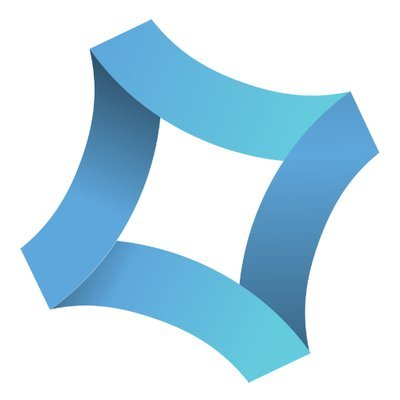
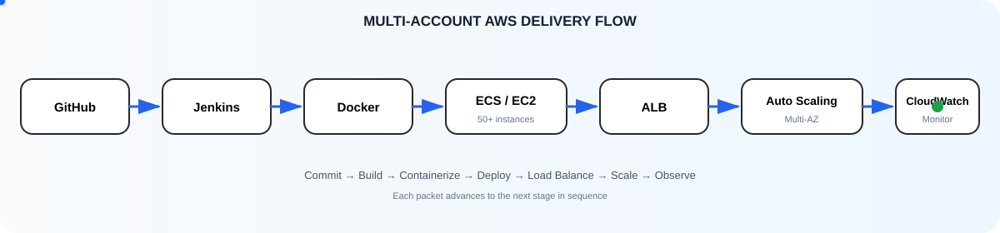
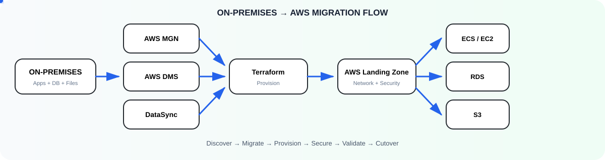
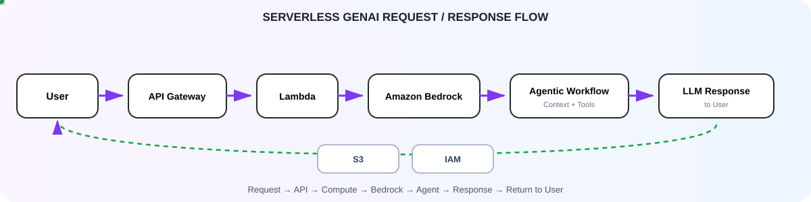

<h1>👋 Hi, I'm Ravi Mishra</h1>

<b>Senior Cloud & DevOps Engineer</b>
&nbsp;&nbsp;:&nbsp;&nbsp;
&nbsp;&nbsp;
&nbsp;&nbsp;

 

## About

<table>
<tr>

<td width="62%" valign="top">

I'm a **Cloud & DevOps Engineer** who enjoys building the infrastructure behind reliable products.

I work primarily with **AWS**, but I'm comfortable moving across infrastructure, automation and operations when a system needs it — from **Infrastructure as Code and CI/CD** to containers, security and observability.

A big part of my work is turning manual or complex infrastructure processes into **repeatable, automated workflows** that are easier to deploy, operate and scale.

I'm also exploring **Generative AI and agentic workflows**, with a particular interest in serverless architectures and Amazon Bedrock.

<td width="38%" valign="top">

<h3>⚡ PROFILE</h3>

<table>
<tr>
<td width="85"><code>BASED IN</code></td>
<td><strong>Noida, India</strong></td>
</tr>

<tr>
<td width="85"><code>OPEN TO</code></td>
<td><strong>Remote or Relocation</strong></td>
</tr>

<tr>
<td width="85"><code>NOW AT</code></td>
<td>

&nbsp;<strong>VVDN Technologies</strong>
</td>
</tr>

<tr>
<td width="85"><code>SPECIALTY</code></td>
<td><strong>AWS · Automation · Infrastructure</strong></td>
</tr>

<tr>
<td width="85"><code>STUDIED</code></td>
<td>

&nbsp;<strong>AKTU Lucknow · B.Tech CSE</strong>
</td>
</tr>
<tr>
<td width="90"><code>CERTIFIED</code></td>
<td>

&nbsp;
<strong>AWS Certified Solutions Architect – Associate</strong>
</td>
</tr>
</table>

</td>
</tr>
</table>

---

# 🧭 What I Do

<table>
<tr>

<td width="50%" valign="top">

### ☁️ Cloud Engineering

AWS infrastructure designed for **availability, scalability and reliability**.

`Architecture` `Multi-AZ` `Networking`  
`Compute` `Storage` `Cost Optimization`

</td>

<td width="50%" valign="top">

### ⚙️ DevOps & Automation

Automated delivery pipelines and repeatable infrastructure workflows.

`CI/CD` `IaC` `Docker`  
`Kubernetes` `Automation` `Release Engineering`

</td>

</tr>

<tr>

<td width="50%" valign="top">

### 🔐 Security & Reliability

Security-first infrastructure with operational resilience and controlled access.

`IAM` `WAF` `Least Privilege`  
`Vulnerability Management` `Production Operations`

</td>

<td width="50%" valign="top">

### 📊 Observability

Production visibility focused on monitoring, alerting and faster troubleshooting.

`CloudWatch` `Datadog` `Prometheus`  
`ELK` `SLOs` `Log Analysis`

</td>

</tr>
</table>

---

# 🚀 Selected Engineering Work

## ☁️ Scalable Multi-Account Cloud Infrastructure

<b>GitHub → Jenkins → Docker → ECS/EC2 → ALB → Auto Scaling → CloudWatch</b>

Multi-Account AWS • 50+ Instances • CI/CD • Containerization • High Availability • Observability

---

## 🔄 On-Premises → AWS Cloud Migration

<b>On-Premises → MGN / DMS / DataSync → Terraform → AWS → ECS / RDS / S3</b>

Cloud Migration • Rehosting • Database Migration • Data Transfer • IaC • AWS Modernization

---

## 🤖 AI Chatbot — Serverless Cloud Architecture

<b>User → API Gateway → Lambda → Amazon Bedrock → Agentic Workflow → LLM Response</b>

Serverless • Generative AI • Amazon Bedrock • Agentic Workflow • IAM • Python

---

# 🛠️ Technology Stack

<table>
<tr>

<td align="center" width="140">
 
<b>Cloud</b>
</td>

<td align="center" width="140">
 
<b>Infrastructure</b>
</td>

<td align="center" width="140">
 
<b>CI/CD</b>
</td>

<td align="center" width="140">
 
<b>Containers</b>
</td>

<td align="center" width="140">
 
<b>Linux</b>
</td>

<td align="center" width="140">
 
<b>Automation</b>
</td>

</tr>

<tr>

<td align="center">
 
<b>Observability</b>
</td>

<td align="center">
 
<b>Databases</b>
</td>

<td align="center">
 
<b>Version Control</b>
</td>

<td align="center">
 
<b>Security</b>
</td>

<td align="center">
 
<b>GenAI / LLM</b>
</td>

<td align="center">
 
<b>Serverless</b>
</td>

</tr>
</table>

### Core Technologies

<b>☁️ AWS Cloud</b>

`EC2` `S3` `RDS` `VPC` `IAM` `Lambda` `ECS` `EKS`  
`CloudFront` `WAF` `Security Hub` `SageMaker` `Systems Manager`  
`Direct Connect` `VPN` `CloudTrail` `Secrets Manager`

<b>🏗️ Infrastructure as Code</b>

`Terraform` `CloudFormation` `Ansible`

<b>⚙️ DevOps & CI/CD</b>

`Jenkins` `GitHub Actions` `AWS CodePipeline` `Git` `GitHub`  
`Automated Testing` `Security Scanning`  
`Blue-Green Releases` `Canary Releases` `Rolling Releases`

<b>📦 Containers & Orchestration</b>

`Docker` `Kubernetes` `Amazon ECS`

<b>📊 Monitoring & Observability</b>

`CloudWatch` `Datadog` `Prometheus` `ELK Stack`  
`Dashboards` `SLO-based Alerts` `Log Analysis`

<b>🔐 Security & Compliance</b>

`IAM` `Security Hub` `Amazon Inspector` `NACLs` `WAF`  
`Security Groups` `Permission Boundaries` `SCPs` `Least Privilege`

<b>💻 Scripting & Automation</b>

`Python` `Bash` `Shell Scripting`

<b>🗄️ Databases</b>

`MySQL` `MongoDB` `Amazon DocumentDB`

<b>🤖 AI & LLM</b>

`Amazon Bedrock` `AWS DevOps Agent` `Claude`

---

# 📈 Engineering Focus

<table>
<tr>

<td align="center">☁️ <b>Cloud Architecture</b></td>
<td align="center">⚙️ <b>DevOps Automation</b></td>
<td align="center">🏗️ <b>Infrastructure as Code</b></td>
<td align="center">🔐 <b>Cloud Security</b></td>

</tr>

<tr>

<td align="center">📊 <b>Observability</b></td>
<td align="center">🔄 <b>Cloud Migration</b></td>
<td align="center">🐳 <b>Containers</b></td>
<td align="center">🤖 <b>Generative AI</b></td>

</tr>
</table>

---

### 💡 Build it. Automate it. Secure it. Scale it.

 

